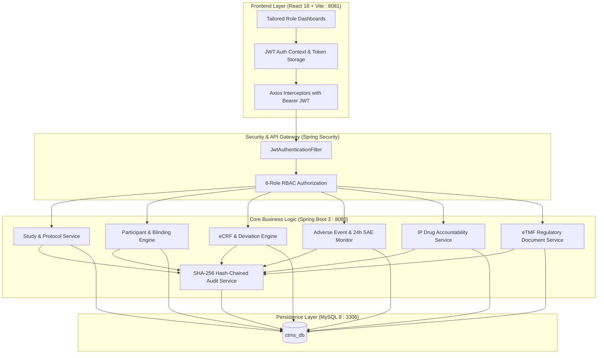

# 🏥 Clinical Trial Management System (CTMS)

[](https://spring.io/projects/spring-boot)
[](https://reactjs.org/)
[](https://vitejs.dev/)
[](https://www.mysql.com/)
[](https://openjdk.org/)
[](https://spring.io/projects/spring-security)
[](https://www.fda.gov/regulatory-information/search-fda-guidance-documents/part-11-electronic-records-electronic-signatures-scope-and-application)

A production-grade, full-stack **Clinical Trial Management System (CTMS)** engineered in strict alignment with **ICH-GCP E6(R2)** guidelines and **FDA 21 CFR Part 11** electronic record / signature regulations. CTMS empowers clinical research sponsors, principal investigators, contract research organizations (CROs), and regulatory monitors to collaborate securely across the entire clinical trial lifecycle.

---

## 📑 Table of Contents

- [Key Highlights & Architecture](#-key-highlights--architecture)
- [Regulatory & Compliance Architecture](#-regulatory--compliance-architecture)
- [System Workflow & Architecture Diagram](#-system-workflow--architecture-diagram)
- [Role-Based Access Control (RBAC) Matrix](#-role-based-access-control-rbac-matrix)
- [Pre-Seeded Demo Credentials](#-pre-seeded-demo-credentials)
- [Technology Stack](#-technology-stack)
- [Prerequisites](#-prerequisites)
- [Step-by-Step Execution Guide](#-step-by-step-execution-guide)
  - [Step 1: Database Setup](#step-1-database-setup)
  - [Step 2: Backend Service Setup](#step-2-backend-service-setup)
  - [Step 3: Frontend Client Setup](#step-3-frontend-client-setup)
  - [Step 4: End-to-End Clinical Trial Verification](#step-4-end-to-end-clinical-trial-verification)
- [API Endpoints & Swagger Documentation](#-api-endpoints--swagger-documentation)
- [Troubleshooting & FAQ](#-troubleshooting--faq)
- [Project Directory Structure](#-project-directory-structure)

---

## 🌟 Key Highlights & Architecture

- **End-to-End Study Governance**: Create protocols, manage sites, designate principal investigators, freeze datasets, and enforce database lock procedures.
- **Subject Lifecycle & Blinding**: Pseudonymized Subject IDs, AES-256 encrypted treatment allocations, enrollment screening, and patient portal access.
- **Electronic Case Report Forms (eCRF)**: Real-time data entry validation, automated protocol deviation detection, field discrepancy tracking, and 21 CFR Part 11 electronic signatures.
- **Data Queries & Discrepancy Management**: Query lifecycle (`OPEN`, `RESOLVED`, `CLOSED`) between Data Managers and Site Coordinators.
- **Pharmacovigilance & Safety (AE / SAE)**: Real-time 24-hour countdown clock for Serious Adverse Events (SAEs), SUSAR triage, and automated background audit checks.
- **Investigational Product (IP) Accountability**: Kit dispatch, dispensing logs, return reconciliation, temperature breach reporting, and destroyed balance verification.
- **Electronic Trial Master File (eTMF)**: Essential document indexing, versioning, expiry tracking, and regulatory audit readiness.

---

## 🛡️ Regulatory & Compliance Architecture

The system implements rigorous digital checks mandated by global regulatory agencies:

| Regulatory Mandate | Technical Implementation in CTMS | Code Reference |
| :--- | :--- | :--- |
| **Tamper-Evident Audit Trails** *(21 CFR § 11.10(e))* | Every insert, update, and signature creates an immutable audit record linked via **SHA-256 hash chaining** (`currentHash = sha256(previousHash + payload)`), forming a tamper-evident blockchain-style log. | `AuditService.java` |
| **Blinded Treatment Secrecy** *(ICH GCP E6 5.13)* | Randomization kit assignments and treatment arms are cryptographically sealed using **AES-256** encryption to prevent investigator bias. | `EncryptionUtil.java` |
| **Electronic Signatures** *(21 CFR § 11.50 / § 11.100)* | All critical clinical sign-offs (eCRF sign, study approval, protocol lock) require forced password re-authentication, explicit legal reason declaration, and timestamped stamping. | `EcrfService.java` |
| **Protocol Deviation Detection** *(ICH GCP E6 4.5)* | Clinical data entered into eCRFs is automatically evaluated against protocol inclusion/exclusion criteria and physiological thresholds upon save. | `EcrfService.java` |
| **Expedited SAE Reporting** *(FDA 21 CFR § 312.32)* | Any Adverse Event marked as **Serious (SAE)** triggers an automated **24-hour compliance countdown**. An automated `@Scheduled` cron job inspects overdue events every 5 minutes. | `AdverseEventService.java` |
| **Brute-Force & Session Security** | Configured for account lockout after **5 consecutive failed attempts**, **15-minute idle timeouts**, **60-day password cycling**, and dual JWT expirations (8h staff / 24h patient). | `application.yml` |

---

## 📐 System Workflow & Architecture Diagram



---

## 👥 Role-Based Access Control (RBAC) Matrix

CTMS implements 8 distinct clinical user roles with granular principle-of-least-privilege permissions:

| Feature / Module | Admin | Sponsor | Principal Inv. (PI) | Sub-Inv. | Site Coordinator | Data Manager | Regulatory Affairs | Participant |
| :--- | :---: | :---: | :---: | :---: | :---: | :---: | :---: | :---: |
| **Studies Management** | Full | Create / Monitor | Read / Sign | Read | Read | Read | Read / Inspect | Assigned Study |
| **Participant Enrollment** | Full | View Blinded | Enroll / Randomize | Screen | Enroll / Screen | View Blinded | View Status | Self Profile |
| **eCRF Data Entry** | Full | Read-Only | Sign / Review | Edit | Edit / Submit | Review / Freeze | Audit Read | ePRO Survey |
| **Data Queries** | Full | View Metrics | Respond | Respond | Respond | Raise / Close | View | - |
| **Adverse Events (AE/SAE)** | Full | Monitor / Report | Report / Escalate | Report | Report | Monitor | Regulatory Triage | Report Symptoms |
| **IP Accountability** | Full | Supply Chain | Verify | Dispense | Dispense / Log | Reconcile | Inspect | My Medications |
| **eTMF Regulatory Docs** | Full | Upload / Review | Upload / View | View | Upload Site Docs | Review | Approve / Audit | Consent Forms |
| **Audit Logs & Users** | Full | View Audit | - | - | - | View Audit | Full Audit Read | - |

---

## 🔑 Pre-Seeded Demo Credentials

All seeded demo accounts use the standard password: **`Demo@1234`**

| Role | Username | Password | Email | GCP Cert ID | Default Landing View |
| :--- | :--- | :--- | :--- | :--- | :--- |
| **System Administrator** | `admin` | `Demo@1234` | `admin@ctms.com` | `N/A` | System Health & Audit Logs |
| **Sponsor** | `sponsor` | `Demo@1234` | `sponsor@ctms.com` | `GCPSP001` | Portfolio & Study Milestones |
| **Principal Investigator** | `pi_user` | `Demo@1234` | `pi@ctms.com` | `GCPPI002` | Site Overview & Investigator Sign-off |
| **Sub-Investigator** | `subinv` | `Demo@1234` | `subinv@ctms.com` | `GCPSI003` | Subject Visits & Clinical Evaluations |
| **Site Coordinator** | `coordinator` | `Demo@1234` | `coord@ctms.com` | `GCPSC004` | Subject Visits, eCRF & IP Dispensing |
| **Data Manager** | `datamanager` | `Demo@1234` | `dm@ctms.com` | `GCPDM005` | Query Resolution & eCRF Verification |
| **Regulatory Affairs** | `regaffairs` | `Demo@1234` | `reg@ctms.com` | `GCPRA006` | eTMF Inspection & SAE Oversight |
| **Participant** | `participant1` | `Demo@1234` | `participant@ctms.com` | `N/A` | Patient Diary & Medication Schedule |

---

## 💻 Technology Stack

### Backend
- **Framework**: Spring Boot 3.2.5
- **Language**: Java 17 (LTS)
- **Security**: Spring Security 6, JJWT 0.11.5 (HMAC-SHA256), BCrypt
- **Persistence**: Spring Data JPA, Hibernate 6, MySQL Connector/J
- **API Documentation**: SpringDoc OpenAPI 2.5.0 (Swagger UI)
- **Utilities**: Project Lombok, Jakarta Validation

### Frontend
- **Framework**: React 18.3.1 with Vite 5.2
- **Routing**: React Router DOM v6
- **HTTP Client**: Axios with JWT Bearer Interceptors & Auto-Logout on 401
- **Icons**: Lucide React
- **Visual Analytics**: Recharts
- **Styling**: Modern Responsive CSS3 (Glassmorphism, Clinical Theme)

### Database & Infrastructure
- **Database**: MySQL 8.0
- **Containerization**: Docker & Docker Compose

---

## 📋 Prerequisites

Before running the application, ensure the following software is installed on your operating system:

| Prerequisite | Minimum Version | Verification Command |
| :--- | :--- | :--- |
| **Java JDK** | 17+ (JDK 17 or 21) | `java -version` |
| **Apache Maven** | 3.8+ | `mvn -version` |
| **Node.js** | 18+ (LTS recommended) | `node -v` |
| **npm** | 9+ | `npm -v` |
| **MySQL Server** *(Option A)* | 8.0+ | `mysql --version` |
| **Docker & Docker Compose** *(Option B)* | Latest | `docker --version` |

---

## 🚀 Step-by-Step Execution Guide

Follow these steps sequentially to launch and run CTMS on your workstation.

---

### Step 1: Database Setup

You can choose either your local MySQL installation (**Option A**) or Docker (**Option B**).

#### Option A: Using Local MySQL (Recommended for Native Setup)
1. Verify that your local MySQL 8.0 service is running:
   - **Windows (PowerShell)**:
     ```powershell
     Get-Service -Name *mysql*
     ```
   - **macOS / Linux**:
     ```bash
     sudo systemctl status mysql    # Linux
     brew services list             # macOS
     ```
2. Verify database connection credentials in `backend/src/main/resources/application.yml`:
   ```yaml
   spring:
     datasource:
       url: jdbc:mysql://localhost:3306/ctms_db?createDatabaseIfNotExist=true&useSSL=false&allowPublicKeyRetrieval=true&serverTimezone=UTC
       username: root
       password: root
   ```
   > [!NOTE]
   > `ctms_db` will be **automatically created** upon first boot thanks to the `createDatabaseIfNotExist=true` parameter. If your local MySQL root password is not `root`, update `password` in `backend/src/main/resources/application.yml`.

#### Option B: Using Docker for MySQL
If you prefer running MySQL in an isolated container:
```bash
# In the project root directory:
docker-compose up -d
```
To verify the container is healthy:
```bash
docker ps
```

---

### Step 2: Backend Service Setup

1. Open a new terminal window and navigate to the `backend` directory:
   ```bash
   cd backend
   ```

2. *(Optional)* Verify compilation and dependencies:
   ```bash
   mvn clean compile
   ```

3. Launch the Spring Boot application:
   ```bash
   mvn spring-boot:run
   ```

4. **Verify Backend Status**:
   - The console will display:
     ```text
     Started CtmsApplication in X.XXX seconds (process running for X.XXX)
     Checking user directory in MySQL database...
     User directory seeding verified in MySQL database.
     ```
   - Backend API base URL: **`http://localhost:8080`**
   - Interactive Swagger UI: **`http://localhost:8080/swagger-ui.html`**
   - OpenAPI Raw JSON: **`http://localhost:8080/api-docs`**

---

### Step 3: Frontend Client Setup

1. Open a **second** terminal window and navigate to the `frontend` directory:
   ```bash
   cd frontend
   ```

2. Install client dependencies (if not already installed):
   ```bash
   npm install
   ```

3. Launch the Vite development server:
   ```bash
   npm run dev
   ```

4. **Verify Frontend Status**:
   - The console will display:
     ```text
       VITE v5.2.11  ready in XXX ms

       ➜  Local:   http://localhost:8081/
       ➜  Network: use --host to expose
     ```
   - Open your web browser and navigate to: **`http://localhost:8081`**

---

### Step 4: End-to-End Clinical Trial Verification

Follow this walkthrough to verify that all clinical modules and compliance subsystems are operating correctly:

1. **Log in as Administrator**:
   - URL: `http://localhost:8081/login`
   - Username: `admin` | Password: `Demo@1234`
   - Navigate to **Admin > Audit Logs** to observe the **SHA-256 Hash Chain** starting at `GENESIS`.
2. **Review Studies**:
   - Navigate to **Studies** (`/studies`) to inspect active clinical protocols, phases, and site allocations.
3. **Inspect Participants & Randomization**:
   - Navigate to **Participants** (`/participants`) to observe pseudonymized patient identifiers and AES-256 blinded treatment arms.
4. **Test eCRF Data Capture & Electronic Signatures**:
   - Navigate to **eCRF** (`/ecrf`) to view visit data, submit vital signs/evaluations, and trigger a 21 CFR Part 11 compliant digital signature.
5. **Inspect Safety & Adverse Events**:
   - Navigate to **Adverse Events** (`/adverse-events`) to view the real-time **24-Hour SAE Countdown Clock** for pharmacovigilance tracking.
6. **Track IP Accountability**:
   - Navigate to **IP Accountability** (`/ip`) to verify investigational drug batch numbers, dispensed units, and return reconciliation.
7. **Query Resolution**:
   - Navigate to **Queries** (`/queries`) to view queries raised by Data Managers and respond as clinical site personnel.

---

## 📡 API Endpoints & Swagger Documentation

Interactive OpenAPI documentation is available at **`http://localhost:8080/swagger-ui.html`**.

| Module | Endpoint Base | Key Methods | Description |
| :--- | :--- | :---: | :--- |
| **Authentication** | `/api/auth` | `POST` | User login (`/login`), user registration (`/register`), JWT generation |
| **Studies** | `/api/studies` | `GET`, `POST`, `PUT` | Protocol creation, site assignment, study locking |
| **Participants** | `/api/participants` | `GET`, `POST` | Subject screening, enrollment, unblinding requests |
| **eCRF Forms** | `/api/ecrf` | `GET`, `POST`, `PUT` | Visit data capture, protocol deviation detection, e-signature |
| **Data Queries** | `/api/queries` | `GET`, `POST`, `PUT` | Raise clinical data queries, submit site responses |
| **Adverse Events** | `/api/adverse-events` | `GET`, `POST`, `PUT` | AE reporting, SAE 24h escalation, SUSAR triage |
| **IP Accountability** | `/api/ip` | `GET`, `POST` | Kit dispensing, balance enforcement, returns & destruction |
| **Regulatory eTMF** | `/api/documents` | `GET`, `POST` | Trial Master File upload, versioning, expiry monitoring |
| **Administration** | `/api/admin` | `GET`, `POST` | User provisioning, role assignment, tamper-evident audit logs |

---

## 🔧 Troubleshooting & FAQ

<details>
<summary><strong>1. Backend fails to connect to MySQL (<code>Communications link failure</code> or <code>Access denied</code>)</strong></summary>

- Ensure MySQL service is running (`Get-Service -Name *mysql*` on Windows).
- Check your password in `backend/src/main/resources/application.yml`. If your MySQL root password is not `root`, update it there.
- Verify MySQL is listening on port 3306:
  ```powershell
  Test-NetConnection -ComputerName localhost -Port 3306
  ```
</details>

<details>
<summary><strong>2. Port 8080 (Backend) or Port 8081 (Frontend) is already in use</strong></summary>

- **To identify and release port 8080 on Windows**:
  ```powershell
  Get-Process -Id (Get-NetTCPConnection -LocalPort 8080).OwningProcess | Stop-Process -Force
  ```
- **To change Backend port**: Edit `server.port` in `backend/src/main/resources/application.yml`.
- **To change Frontend port**: Edit the `--port` argument in `frontend/package.json` (`"dev": "vite --port 8081"`).
</details>

<details>
<summary><strong>3. Maven Build / Lombok Issues in IDE</strong></summary>

- Ensure **Annotation Processing** is enabled in your IDE settings (Settings > Build, Execution, Deployment > Compiler > Annotation Processors).
- Verify you are running JDK 17+ via `java -version`.
</details>

<details>
<summary><strong>4. Cross-Origin Resource Sharing (CORS) Errors in Browser</strong></summary>

- The backend explicitly allows origins `http://localhost:8081`, `http://127.0.0.1:8081`, `http://localhost:5173`, and `http://localhost:3000` in `application.yml` (`app.cors-allowed-origins`).
- Ensure you access the frontend using `http://localhost:8081`.
</details>

---

## 📂 Project Directory Structure

```text
CTMS Project/
├── backend/
│   ├── pom.xml                               # Maven project configuration (Spring Boot 3.2.5)
│   └── src/
│       ├── main/
│       │   ├── java/com/ctms/
│       │   │   ├── CtmsApplication.java      # Main Spring Boot Application Entry Point
│       │   │   ├── audit/                    # SHA-256 Audit Chaining & AES-256 Encryption
│       │   │   ├── config/                   # Security, Swagger, CORS & DataSeeder
│       │   │   ├── controller/               # REST Controllers (Auth, Study, eCRF, AE, etc.)
│       │   │   ├── dto/                      # Clinical Request/Response Data Transfer Objects
│       │   │   ├── entity/                   # JPA Database Entities (Users, Study, Visit, etc.)
│       │   │   ├── exception/                # Global Exception Handling & Error Formats
│       │   │   ├── repository/               # Spring Data JPA Repositories
│       │   │   ├── security/                 # JWT Provider, Auth Filter & UserDetails
│       │   │   └── service/                  # Business Logic, Deviation Engine, SAE Cron
│       │   └── resources/
│       │       └── application.yml           # Database, Security, JWT & Timeout Config
│       └── test/                             # Unit and Integration Tests
│
├── frontend/
│   ├── index.html                            # Single Page Application HTML Entry Point
│   ├── package.json                          # NPM Scripts & Dependencies (React 18, Vite 5)
│   ├── vite.config.js                        # Vite Configuration & Port Setup
│   └── src/
│       ├── App.jsx                           # Route Declarations & RBAC Route Protection
│       ├── main.jsx                          # React Root Mount
│       ├── index.css                         # Global CSS & Design System
│       ├── api/                              # Axios Instance & Modular API Callers
│       ├── components/                       # Shared Components, Layout, Navigation, Modals
│       ├── context/                          # AuthContext (JWT Session, Login/Logout State)
│       ├── pages/                            # Role Dashboards & Feature Modules
│       │   ├── admin/                        # Audit Trail & User Management Pages
│       │   ├── adverse-events/               # AE Reporting & 24h SAE Countdown Timer
│       │   ├── auth/                         # Login & Registration Pages
│       │   ├── dashboards/                   # 7 Tailored Role-Specific Dashboards
│       │   ├── documents/                    # eTMF Regulatory Document Repository
│       │   ├── ecrf/                         # Case Report Form Data Entry & E-Sign
│       │   ├── ip/                           # Investigational Product Accountability
│       │   ├── participants/                 # Subject Registry & Blinding Views
│       │   ├── queries/                      # Data Query Tracking & Resolution
│       │   └── studies/                      # Clinical Study Protocol Management
│       └── routes/                           # ProtectedRoute & RoleRoute Guards
│
├── docker-compose.yml                        # Docker Compose configuration for MySQL 8.0
└── README.md                                 # Comprehensive System Documentation
```

---

## 📜 Compliance & Legal Disclaimer

This system is engineered for clinical trial data administration adhering to **ICH-GCP E6(R2)** and **FDA 21 CFR Part 11**. In production environments, ensure:
1. End-to-end TLS termination is active via Reverse Proxy / Load Balancer.
2. Hardware Security Module (HSM) or cloud KMS handles the AES-256 master encryption key.
3. Multi-Factor Authentication (MFA/TOTP) is enforced for all clinical personnel.
